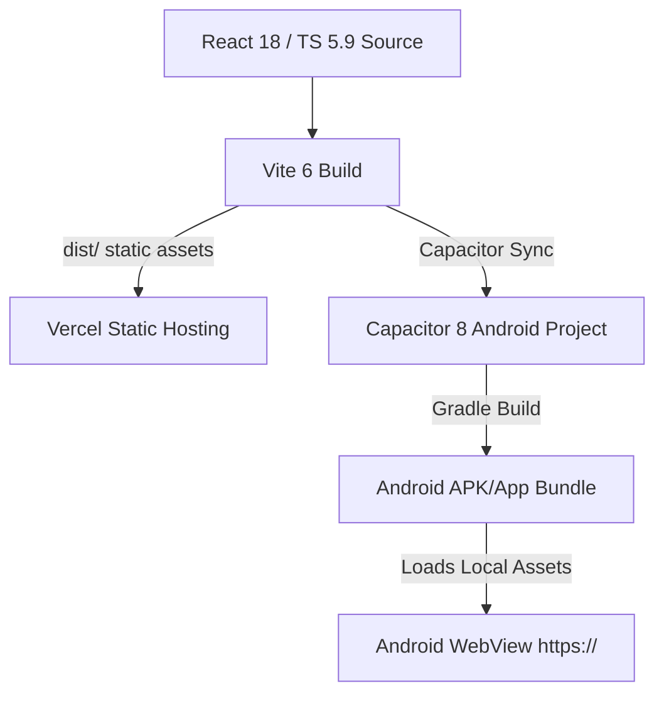
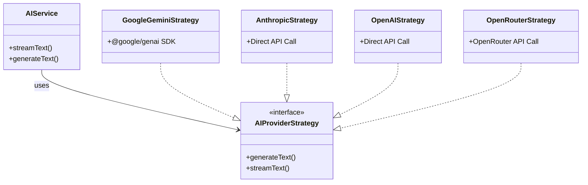

# BÁO CÁO REVIEW TOÀN DIỆN DỰ ÁN: HR-WITH-AI
*Thời gian thực hiện: 29-09-2026*
*Môi trường: Omp Workspace*

Dự án **hr-with-ai** là một ứng dụng Web Single Page Application (SPA) cao cấp kiêm ứng dụng Hybrid Mobile (Android) hoạt động như một Trợ lý Nhân sự thông minh (Intelligent HR Assistant). Hệ thống tích hợp sâu AI để thực hiện phân tích và biên soạn CV/Resume, phỏng vấn giả định (Mock Interview) qua âm thanh và văn bản, và đánh giá kỹ năng (Skill Assessment).

Tài liệu này được biên soạn dựa trên các phân tích chuyên sâu về hệ thống hạ tầng, cơ sở dữ liệu, các phân hệ nghiệp vụ, chiến lược tích hợp AI, bảo mật và chất lượng mã nguồn (qua lăng kính các đợt refactoring lớn gần đây).

---

## 1. TỔNG QUAN KIẾN TRÚC & HẠ TẦNG KỸ THUẬT

### 1.1. Công Nghệ Cốt Lõi (Tech Stack)
Hệ thống được thiết kế theo nguyên lý **Client-First / Local-First**, nhằm tối ưu hóa chi phí vận hành máy chủ và bảo mật thông tin cá nhân của ứng viên.
*   **Frontend Framework:** React 18.3, TypeScript 5.9, Vite 6.4 (môi trường đóng gói siêu tốc).
*   **Styling:** Tailwind CSS v4.2, PostCSS, Autoprefixer.
*   **State Management (3 tầng theo ADR-001):**
    *   *Tầng Persistence (Dữ liệu bền vững):* **Dexie 4.3** (wrapper IndexedDB) - Đóng vai trò là "Source of Truth" duy nhất cho CV, thông tin tuyển dụng, lịch sử phỏng vấn và cấu hình cá nhân.
    *   *Tầng Domain State (Cross-route):* **Zustand 5.0** (quản lý state phòng phỏng vấn `interviewStore`, state giọng nói `voiceInterviewStore`, trắc nghiệm `useSkillAssessmentStore`).
    *   *Tầng Ephemeral UI (Tạm thời):* React `useState` & `useContext` (chủ yếu cho theme và cấu hình thông báo tức thời).
*   **Mobile Framework:** Capacitor 8 (đáp ứng đóng gói ứng dụng di động Android gốc, chỉ sử dụng phân quyền Filesystem và Share).
*   **Testing Infrastructure:** Vitest 4 (kiểm thử đơn vị/tích hợp với JSDOM, v8 Coverage) và Playwright 1.61 (kiểm thử luồng đi E2E).
*   **Thư viện đồ họa & Tiện ích chuyên biệt:**
    *   *Biểu đồ:* Recharts 3 (vẽ sơ đồ năng lực Radar, biểu đồ tiến trình Progress).
    *   *Sơ đồ:* Mermaid 11 (kết xuất lộ trình học tập).
    *   *Bảng vẽ & Soạn thảo:* Tldraw 2.4.6 (vẽ bảng thiết kế kiến trúc) và Monaco Editor (@monaco-editor/react) cho chỉnh sửa code.
    *   *Xử lý PDF:* html-to-image (chụp canvas CV), jspdf (xuất file PDF A4) và pdfjs-dist (phân tích cú pháp văn bản của file CV tải lên).

### 1.2. Kiến Trúc Dual-Deployment (Web & Mobile Hybrid)
Hệ thống sử dụng một mã nguồn duy nhất (`src/`) để đóng gói cho hai nền tảng đích:
1.  **Web App:** Triển khai tĩnh trên Vercel CDN.
2.  **Mobile App:** Đóng gói thông qua Capacitor 8, nạp tài nguyên tĩnh vào WebView di động.



*   **Ràng buộc định tuyến nghiêm ngặt:** Sử dụng `HashRouter` thay vì `BrowserRouter`. Đây là thiết kế chủ ý nhằm tương thích hoàn toàn với cơ chế tải file-system của WebView trên Android (tránh lỗi 404 khi người dùng nạp lại trang trên điện thoại).
*   **Cấu hình di động:** Bật `androidScheme: "https"` trong Capacitor để giải quyết triệt để vấn đề phân quyền Microphone, truy xuất file và ngăn chặn lỗi CORS khi gọi trực tiếp API từ WebView.

### 1.3. Local Dev Parity (Môi trường phát triển đồng bộ)
Hệ thống tích hợp plugin tự chế `localApiPlugin()` trong `vite.config.ts` làm Vite middleware. Plugin này tự động phân tích và chạy trực tiếp Vercel Serverless Function (`api/sync.ts`) bằng cách sử dụng `ssrLoadModule` và giả lập các đối tượng Node.js Request/Response. Điều này giúp lập trình viên phát triển và kiểm thử tính năng đồng bộ hóa đám mây tại Local mà không cần deploy lên Vercel.

---

## 2. KIẾN TRÚC DỮ LIỆU & ĐỒNG BỘ ĐÁM MÂY (DATABASE & CLOUD SYNC)

### 2.1. Quản Trị Cơ Sở Dữ Liệu Local-First (VietPhongDB)
Tất cả dữ liệu người dùng được lưu trữ cục bộ trong cơ sở dữ liệu IndexedDB có tên là **`VietPhongDB`**. 5 bảng chính bao gồm:
1.  `interviews`: Lưu trữ các phiên phỏng vấn giả định, lịch sử hội thoại, các đoạn code, hình vẽ và báo cáo đánh giá.
2.  `userSettings`: Chứa cài đặt hệ thống, API keys của các AI Provider, sttProvider, ttsProvider.
3.  `resumes`: Chứa thông tin CV (dữ liệu thô và dữ liệu phân tích chi tiết).
4.  `jobs`: Danh sách các công việc mục tiêu hoặc tin tuyển dụng đã lưu.
5.  `job_recommendations`: Các gợi ý công việc được đề xuất từ AI.

#### Cơ chế Nén Dữ Liệu CV Tiết Kiệm Dung Lượng (LZ-String v13/v14 Hooks)
Dữ liệu phân tích CV (`parsedData`) rất cồng kềnh. Ở phiên bản DB v13/v14, hệ thống tích hợp thư viện **`LZ-String`** để nén dữ liệu CV trước khi ghi xuống ổ đĩa:
*   **Database Hooks (`creating` / `updating`):** Khi lưu một CV, hook sẽ tự động chạy hàm `compressResumeData(parsedData)` thành chuỗi nén base64 và lưu vào cột `compressedData`, đồng thời gỡ bỏ cột `parsedData` (field-delete của Dexie) để tiết kiệm dung lượng lưu trữ IndexedDB. Nếu nén lỗi, hệ thống giữ nguyên `parsedData` để không mất dữ liệu.
*   **Database Hooks (`reading`):** Khi đọc dữ liệu từ DB, hook tự động giải nén `decompressResumeData(compressedData)` nạp lại vào cột `parsedData` một cách trong suốt (transparent) với UI.
*   **Cơ chế di trú dữ liệu (v14 Upgrade Migration):** Khi người dùng nâng cấp từ các phiên bản cũ lên v14, một hàm tự động `.upgrade()` sẽ quét qua toàn bộ bảng `resumes`, nén các CV cũ chưa được nén và ghi đè an toàn.

### 2.2. Cơ Chế Đồng Bộ Đám Mây Loại Bỏ API Key (Secret-Stripped Sync)

> **Lưu ý về thuật ngữ:** Đồng bộ KHÔNG phải là "Zero-Knowledge" / "E2E đã mã hóa". Dữ liệu chỉ được **nén bằng LZ-String** (`compressToBase64`), không qua bước mã hóa mật mã nào. Máy chủ Neon và bất kỳ ai có quyền đọc cơ sở dữ liệu đều có thể giải nén và đọc được toàn bộ CV, mô tả công việc và bản ghi phỏng vấn. Điều được bảo đảm chỉ là: **API key và URL endpoint không bao giờ rời khỏi thiết bị**.
Dự án cung cấp tính năng sao lưu và đồng bộ tùy chọn thông qua endpoint Serverless **`POST /api/sync`** kết nối tới cơ sở dữ liệu **Neon Postgres**.

*   **Bảo Mật API Keys Cực Hạn (Secret Stripping):** Trước khi đồng bộ dữ liệu lên đám mây, hàm `exportData({ includeSensitive: false })` trong `syncService.ts` sẽ duyệt qua bảng `userSettings` và xóa bỏ toàn bộ các trường nhạy cảm bao gồm: `apiKey`, `githubToken`, `githubUsername`, `googleCloudApiKey`, `elevenLabsApiKey`, `deepgramApiKey` và các API Key bên trong cấu hình `aiProfiles`. Máy chủ trung gian hoàn toàn không lưu trữ API Key của người dùng.
*   **Nhập Dữ Liệu Bảo Mật (Strict Import Guard):** Khi khôi phục dữ liệu từ file backup hoặc từ đám mây, ứng dụng coi dữ liệu nạp vào là **không đáng tin cậy** và chủ động lọc bỏ tất cả API Keys cũng như ghi đè trường `baseUrl` của các profile AI bằng cấu hình local hiện có. Điều này ngăn chặn triệt để cuộc tấn công chuyển hướng API Key về máy chủ kẻ tấn công.
*   **Conflict Resolution (Giải quyết xung đột):** Áp dụng chiến lược **Last-Writer-Wins (LWW)** dựa trên trường `updatedAt` của Dexie. Khi nạp dữ liệu đám mây về (`importData`), hệ thống so sánh mốc thời gian của từng bản ghi, chỉ ghi đè dữ liệu local nếu bản ghi từ đám mây có `updatedAt` mới hơn, đồng thời bảo toàn các API Key hiện tại của thiết bị local.

---

## 3. PHÂN TÍCH CHUYÊN SÂU CÁC PHÂN HỆ TÍNH NĂNG (FEATURES)

Mã nguồn được tổ chức theo cấu trúc Modular hóa cao độ dưới thư mục `src/features/`:

```
src/features/
├── dashboard/        # Thiết lập phiên phỏng vấn, chọn CV, nhập JD tuyển dụng
├── cv-studio/        # "Phòng thí nghiệm" điều chỉnh CV, chat với AI đề xuất chỉnh sửa
├── resume-builder/   # Trình tạo CV kéo thả, import từ GitHub, xuất PDF chuẩn A4
├── interview/        # Buồng phỏng vấn văn bản/giọng nói, Code Editor, Whiteboard
├── skill-assessment/ # Trình kiểm tra năng lực qua Quiz động do AI sinh ra
├── history/          # Lịch sử luyện tập, lộ trình học tập, biểu đồ Recharts
└── settings/         # Quản lý API Profiles của các nhà cung cấp AI
```

### 3.1. Phân Hệ Dashboard & Setup Room
*   **Chức năng:** Là điểm khởi đầu cho một phiên luyện tập. Người dùng chọn một CV hiện có trong hệ thống, nhập Mô tả công việc (Job Description - JD) hoặc thông tin Công ty mục tiêu.
*   **Tính năng AI: Tailor Resume Modal:** AI phân tích mức độ phù hợp giữa CV hiện tại với JD và đưa ra cảnh báo điểm thiếu sót. Cho phép tối ưu nhanh CV (`TailorResumeModal.tsx`) để tạo ra một bản CV nháp phù hợp nhất với vị trí ứng tuyển trước khi phỏng vấn.

### 3.2. Phân Hệ CV Studio (Phòng thí nghiệm CV)
*   **Chức năng:** Giao diện chia đôi màn hình (Split View): Bên trái là khung Chat hỗ trợ AI, bên phải là bản xem trước PDF trực quan của CV.
*   **Tính năng cốt lõi: AI-Driven Change Review:**
    *   Người dùng trò chuyện với AI để nhờ sửa đổi CV (ví dụ: "Hãy viết lại phần kinh nghiệm làm việc tại công ty A chuyên nghiệp hơn").
    *   AI không trực tiếp thay đổi CV mà trả về đề xuất chỉnh sửa dưới dạng các thẻ hành động trực quan (**`ChangeReviewCard.tsx`**).
    *   Hệ thống sử dụng bộ lọc regex bắt thẻ đặc biệt `ACTION` (ví dụ: `[ACTION:update]`) để trích xuất các thay đổi được đề xuất. Dữ liệu thay đổi được kiểm tra (validate) qua schema `proposedChangeSchema` của Zod trước khi hiển thị lên giao diện.
    *   Người dùng có quyền nhấn **"Accept"** (Chấp nhận thay đổi, cập nhật trực tiếp vào IndexedDB của CV) hoặc **"Reject"** (Từ chối).

### 3.3. Phân Hệ Resume Builder (Trình soạn thảo CV)
*   **Chức năng:** Hỗ trợ tạo CV từ đầu bằng giao diện kéo thả trực quan.
*   **Tính năng nổi bật:**
    *   *Kéo thả sắp xếp:* Sử dụng thư viện `@dnd-kit` cho phép kéo thả reorder các phần (Sections) hoặc các đầu mục kinh nghiệm trong CV (`SectionReorderDialog.tsx`).
    *   *Nhập dữ liệu tự động từ GitHub:* `useGitHubImport` kết hợp với `githubAIService` cho phép người dùng nhập link repository GitHub. AI sẽ phân tích cấu trúc cây thư mục, file README, và các tệp mã nguồn chính của Repo để tự động viết thành một dự án CV mẫu hoàn chỉnh, chuẩn kỹ thuật.
    *   *Xuất bản PDF chuyên nghiệp:* Tích hợp `jspdf` và `html-to-image` để chụp khung hiển thị CV và kết xuất file PDF chuẩn kích thước A4. CSS in ấn chuyên biệt (`@media print` trong `index.css`) đảm bảo ẩn toàn bộ các nút điều hướng, căn lề A4 chuẩn, chống vỡ trang (`page-break-inside: avoid` trên các thẻ heading/kinh nghiệm).

### 3.4. Phân Hệ Interview Room (Buồng phỏng vấn giả định)
Đây là phân hệ phức tạp nhất trong toàn bộ ứng dụng, kết hợp giao diện phỏng vấn đa phương thức.
*   **Hỗ trợ đa phương thức:** Phỏng vấn qua nhắn tin (Text) hoặc Phỏng vấn qua giọng nói (Voice Interview).
*   **Voice State Machine (Máy trạng thái âm thanh):** 
    *   Trạng thái âm thanh được điều khiển chặt chẽ thông qua Zustand (`voiceInterviewStore.ts`) và hook `useVoiceInterview.ts` với các trạng thái: `idle` → `recording` (Ghi âm giọng nói ứng viên) → `transcribing` (Chuyển âm thanh thành văn bản qua Whisper/WebSpeech) → `thinking` (AI suy nghĩ câu trả lời) → `synthesizing` (Chuyển câu trả lời AI thành giọng nói qua ElevenLabs) → `speaking` (Phát âm thanh câu trả lời qua loa) → quay lại `recording`.
*   **Công cụ đi kèm (Integrated Tools):**
    *   *Code Editor:* Tích hợp Monaco Editor trực tiếp trong phòng phỏng vấn để ứng viên giải các bài tập coding thuật toán thực tế.
    *   *Whiteboard:* Tích hợp Canvas vẽ tự do của Tldraw giúp ứng viên phác thảo kiến trúc hệ thống (System Design).
    *   *Interview Hints:* AI tự động theo dõi tiến trình và đưa ra gợi ý thông minh (`useInterviewHints.ts`) khi ứng viên gặp khó khăn hoặc dừng lại quá lâu.
*   **Phản hồi & Đánh giá (Feedback & Recommendations):**
    *   Sau khi kết thúc phỏng vấn bằng thẻ `[[END_SESSION]]` từ AI, ứng dụng chuyển sang `FeedbackView.tsx` hiển thị phân tích điểm số chi tiết bằng Recharts Radar chart.
    *   Hệ thống tự động liên kết với `jobRecommendationService.ts` để hiển thị modal đề xuất các tin tuyển dụng thực tế phù hợp với kết quả phỏng vấn của ứng viên (`JobRecommendationModal.tsx`).

### 3.5. Phân Hệ Skill Assessment (Đánh giá năng lực)
*   **Chức năng:** Cho phép ứng viên kiểm tra kiến thức về một kỹ năng cụ thể.
*   **Quy trình hoạt động:**
    1.  *Tải CV hoặc Chọn Kỹ năng:* AI phân tích CV trích xuất danh sách kỹ năng chuyên môn.
    2.  *Sinh Câu hỏi trắc nghiệm Động (QuizStep):* AI tự động tạo ra bộ đề kiểm tra trắc nghiệm 5-10 câu hỏi tùy chỉnh dựa trên trình độ của ứng viên (Junior/Middle/Senior).
    3.  *Nạp Trạng Thái:* Quản lý qua `useSkillAssessmentStore.ts`.
    4.  *Đánh Giá Chi Tiết:* Trả về phân tích điểm mạnh, điểm yếu kèm biểu đồ radar kỹ năng.

### 3.6. Phân Hệ Lịch Sử & Lộ Trình Học Tập (History & Learning Path)
*   **Chức năng:** Lưu trữ lịch sử toàn bộ các phiên phỏng vấn và kiểm tra kỹ năng của ứng viên.
*   **Tiến trình Trực quan:** Hiển thị biểu đồ Recharts theo dõi sự tiến bộ theo thời gian.
*   **Lộ Trình Học Tập (Learning Path):** Sử dụng thư viện **Mermaid 11** để kết xuất biểu đồ lộ trình học tập dạng SVG động do AI đề xuất. AI phân tích các điểm yếu từ lịch sử phỏng vấn để vẽ ra lộ trình học tập chi tiết (Bước 1 -> Bước 2 -> Bước 3).

---

## 4. CHIẾN LƯỢC TÍCH HỢP AI & XỬ LÝ ÂM THANH

### 4.1. Kiến Trúc AI Đa Nhà Cung Cấp (Multi-Provider Strategy)
Dự án không phụ thuộc vào một mô hình AI duy nhất mà định nghĩa một Interface chung là `AIProviderStrategy` nằm trong `src/services/ai/ai.service.ts`. Các strategy cụ thể triển khai interface này:
*   **`GoogleGeminiStrategy`:** Sử dụng SDK mới nhất `@google/genai` gọi model `gemini-1.5-flash` và `gemini-1.5-pro`. Tích hợp trực tiếp JSON Schema thông qua thuộc tính `responseSchema` để bắt ép model trả về đúng cấu trúc dữ liệu JSON cần thiết (trừ trường hợp dùng custom baseUrl).
*   **`AnthropicStrategy`:** Gọi trực tiếp mô hình Claude-3.5-Sonnet cho các tác vụ cần tư duy logic phức tạp, viết prompt chi tiết.
*   **`OpenAIStrategy`:** Hỗ trợ gọi các model GPT-4o, GPT-4o-mini thông qua API chính thức.
*   **`OpenRouterStrategy`:** Giải pháp dự phòng kinh tế cho phép kết nối tới hàng trăm mô hình mã nguồn mở thông qua cổng OpenRouter.



### 4.2. Hệ thống Fallback Thông Minh (FallbackAIService)
Để đảm bảo ứng dụng không bao giờ bị gián đoạn khi nhà cung cấp AI chính gặp sự cố (Rate Limit, Server Down), hệ thống triển khai **`FallbackAIService.ts`**:
1.  Khi một yêu cầu AI được kích hoạt, `aiCandidateResolver` sẽ xác định danh sách các "ứng cử viên" AI dự phòng dựa trên cấu hình Profile của người dùng.
2.  Hệ thống thử gọi Provider ưu tiên số 1.
3.  Nếu xảy ra lỗi `AIProviderError`, hệ thống tự động bắt lỗi, ghi log, gửi thông báo cảnh báo nhẹ đến giao diện và tự động chuyển sang gọi mô hình dự phòng số 2.
4.  *Quy tắc loại trừ:* Đối với các tác vụ yêu cầu đầu ra có cấu trúc chính xác (Structured Output) sử dụng schema phức tạp, hệ thống sẽ bỏ qua fallback nếu cấu hình mô hình phụ không đảm bảo khả năng render đúng schema, tránh gây lỗi crash ứng dụng.

### 4.3. Hệ thống Prompts Cô Lập
Prompts được tách biệt hoàn toàn khỏi mã nguồn UI và được lưu trữ tập trung tại `src/services/prompts/`:
*   `interview.ts`: Chứa hệ thống prompt khổng lồ định hình tính cách người phỏng vấn (Interviewer Persona), chia làm các cấp độ hành vi, quy tắc chấm điểm và cơ chế xuất thẻ `[[END_SESSION]]`.
*   `resume.ts`: Chứa prompt phân tích cấu trúc CV, tối ưu từ khóa, phát hiện lỗi chính tả/ngữ pháp và định dạng.
*   `jobs.ts` & `company.ts`: Prompt so khớp CV với JD, sinh câu hỏi phỏng vấn dựa trên lĩnh vực công ty.

### 4.4. Xử Lý Giọng Nói & Âm Thanh (Speech-to-Text & Text-to-Speech)
*   **Speech-to-Text (STT):**
    *   Hỗ trợ chế độ rảnh tay thông qua `audioRecorderService.ts` sử dụng API ghi âm chuẩn Web MediaRecorder.
    *   *Công nghệ chuyển đổi:* Cho phép lựa chọn giữa **Web Speech API** (Miễn phí, chạy trực tiếp trên engine của trình duyệt Chrome/Android WebView) và **Deepgram / Whisper API** (Chuyển đổi chất lượng cao bằng AI thông qua API Key cá nhân của người dùng).
*   **Text-to-Speech (TTS):**
    *   AI trả về câu trả lời dưới dạng văn bản. Hệ thống chuyển đổi sang giọng nói sinh động qua `textToSpeechService.ts`.
    *   Hỗ trợ **Web Speech Synthesis** (Mặc định trình duyệt) và tích hợp **ElevenLabs API** (Tái tạo giọng nói tự nhiên chất lượng studio chuyên nghiệp).

---

## 5. DESIGN SYSTEM & UI/UX (TAILWIND CSS V4)

Dự án sử dụng bộ nhận diện giao diện hiện đại, chuyên nghiệp, tối ưu hóa cho cả desktop lẫn môi trường WebView di động.

### 5.1. Kiến Trúc Token Màu Sắc CSS-First
Dự án đã nâng cấp lên **Tailwind CSS v4.2**, chuyển đổi toàn bộ cơ chế thiết lập giao diện từ tệp cấu hình Javascript sang CSS-First trực tiếp trong `src/index.css` sử dụng chỉ thị `@theme`:
*   Các biến màu sắc được định nghĩa dưới dạng mã màu HSL CSS Variables (e.g. `--background`, `--primary`, `--card`).
*   Hỗ trợ tự động chế độ Sáng/Tối (**Dark / Light Mode**) thông qua class `.dark` đính kèm vào thẻ `document.documentElement` từ `theme-provider.tsx`.

```css
/* Trích đoạn index.css */
@import "tailwindcss";
@config "../tailwind.config.js";

@theme {
  --color-background: hsl(var(--background));
  --color-foreground: hsl(var(--foreground));
  --color-primary: hsl(var(--primary));
  --color-card: hsl(var(--card));
  /* ... mapping ~26 tokens màu sắc */
}
```

*Lưu ý về tệp `tailwind.config.js`:* Tệp này vẫn được liên kết bằng `@config "../tailwind.config.js"` trong `src/index.css` để cung cấp cấu hình tương thích ngược (như pulse-slow animation). Hệ thống vẫn đang tải nó, nên không được xóa tệp này để tránh phá vỡ giao diện.

### 5.2. Các Thành Phần Trải Nghiệm Người Dùng (UX Touchpoints)
*   **Sự phản hồi trực quan (Micro-interactions & Feedbacks):**
    *   Sử dụng thư viện **Sonner Toaster** đặt tại chân trang (`mb-safe` để tránh đè lên nút điều hướng cứng của điện thoại) để thông báo nhanh các trạng thái kết nối, đồng bộ, cập nhật CV.
    *   Giao diện chờ AI sử dụng các khung xương giả lập (**Skeleton Screens**) mượt mà giúp giảm cảm giác chờ đợi của ứng viên.
*   **Xử lý Lỗi Toàn Cục (Error Boundaries):**
    *   Ứng dụng bọc trong `ErrorBoundary.tsx` và `GlobalErrorHandler.tsx`. Khi có lỗi runtime không mong muốn xảy ra (ví dụ: thư viện PDF bị lỗi phân tích cú pháp), thay vì crash trắng màn hình, hệ thống hiển thị giao diện báo lỗi thân thiện cho phép người dùng tải lại trang hoặc xuất bản sao lưu DB khẩn cấp để không mất dữ liệu.

---

## 6. KIỂM THỬ, CI/CD & DEPLOY (Testing, Pipeline & Deploy)

Dự án xây dựng một kim tự tháp kiểm thử ba lớp vô cùng chặt chẽ để đảm bảo tính ổn định tối đa cho sản phẩm:

*   **Vitest & React Testing Library (Unit / Integration):**
    *   Chạy trong môi trường giả lập trình duyệt `jsdom`.
    *   *Coverage Thresholds (Ngưỡng phủ tối thiểu):* Được cấu hình cứng trong `vite.config.ts` nhằm đảm bảo chất lượng code: **Lines >= 30%, Functions >= 25%, Branches >= 25%, Statements >= 30%**.
    *   *Nội dung test:* Tập trung vào các file logic cốt lõi, dịch vụ AI (`fallbackAIService.test.ts`), cơ sở dữ liệu (`db.test.ts` kiểm thử kỹ lưỡng cơ chế nén CV), và các hooks state phức tạp (`useCVStudio.test.ts`, `useVoiceInterview.test.ts`).
*   **Playwright (End-to-End Testing):**
    *   Nằm tại thư mục `/e2e`. Chạy các kịch bản kiểm thử tích hợp thực tế trên trình duyệt Chromium thật.
    *   *Crawler Testing:* Chạy kịch bản quét tự động qua tất cả các Hash Routes chính của ứng dụng (`/`, `#/cv-studio`, `#/interview`, `#/skill-assessment`, `#/history`) và khẳng định không có lỗi Console PageError nào xuất hiện và giao diện Header hiển thị đúng.
*   **GitHub Actions (CI/CD Pipeline):**
    *   Tự động chạy mỗi khi có Pull Request hoặc Commit mới đẩy lên nhánh chính.
    *   Quy trình kiểm duyệt bắt buộc: `Lint` (ESLint) → `Format check` (Prettier) → `Type check` (tsc --noEmit) → `Run Vitest` → `Run Playwright E2E`. Chỉ khi tất cả các bước này vượt qua thành công, hệ thống mới cho phép đóng gói build sản phẩm.

---

## 7. ĐÁNH GIÁ ƯU ĐIỂM, NHƯỢC ĐIỂM & ĐỀ XUẤT PHÁT TRIỂN

### 7.1. Ưu Điểm Nổi Bật (Pros)
*   **Triết lý Local-First Xuất Sắc:** Ứng dụng chạy mượt mà ngay cả khi ngoại tuyến (offline). Việc bảo mật dữ liệu cá nhân CV và API Keys bằng cách chỉ lưu trữ local là một điểm cộng cực lớn về quyền riêng tư.
*   **Giải quyết triệt để Nợ Kỹ thuật (Technical Debt Remediated):** 
    *   Qua nghiên cứu lịch sử phát triển (`IMPROVEMENT_ROADMAP.md`), dự án đã hoàn thành xuất sắc các giai đoạn tái cấu trúc lớn từ Phase 0 đến Phase 6.
    *   **Bảo mật:** Dọn dẹp hoàn tất **0 rò rỉ lỗ hổng bảo mật mức High/Critical** (đạt tiêu chuẩn NPM audit sạch).
    *   **Bắt lỗi và Ghi nhật ký:** Banned hoàn toàn các hàm `console.log` tự phát trong app code, thay thế bằng việc tích hợp hệ thống `logger` chuyên biệt hỗ trợ tắt bật linh hoạt trong môi trường Production.
    *   **Phân rã các God-Files:** Các tệp tin khổng lồ trước đây như `InterviewRoom` hay `FeedbackView` đã được phân rã thành công sang các hooks và components cô lập (`useSetupAIActions`, `useInterviewHints`, v.v.), giúp giảm thiểu tối đa blast-radius của lỗi.
*   **Kiến trúc Multi-AI & Giọng nói mượt mà:** Hệ thống Multi-Provider bền bỉ nhờ thiết kế Fallback tự động kết hợp máy trạng thái giọng nói của buồng phỏng vấn.

### 7.2. Điểm Yếu & Rủi Ro Kỹ Thuật (Cons / Code Smells)
*   **Tương thích ngược tệp Tailwind cũ:** Tệp cấu hình `tailwind.config.js` kiểu v3 vẫn được duy trì độc lập. Dù đây không phải là tệp chết (do vẫn được chỉ định bằng `@config` trong `src/index.css`), cấu hình này tạo sự phân mảnh với cú pháp khai báo CSS-first của Tailwind v4, tăng độ khó khi muốn di trú hoàn toàn sang v4 nguyên bản.
*   **Trùng lặp mã nguồn cục bộ:**
    *   Hàm làm sạch chuỗi JSON `cleanJsonString` trong `src/services/ai/aiUtils.ts` bị trùng lặp mã nguồn với `cleanStructuredOutput` trong `src/lib/aiStructuredOutput.ts`.
    *   Mã nguồn `src/services/jobs/jobRecommendationService.ts` vẫn chứa một số hàm rác (stub/mock) chưa đồng bộ và đồng nhất hoàn toàn với `jobAIService.ts`.
*   **Thiếu Service Worker cho Web PWA:** Dù Capacitor giải quyết tốt bài toán offline trên Android WebView, nhưng trên môi trường Web, dự án chưa có Service Worker hay Manifest để biến ứng dụng thành một Progressive Web App (PWA) thực thụ khi người dùng truy cập qua Safari/Chrome.

### 7.3. Đề Xuất Cải Tiến Kỹ Thuật (Recommendations)
1.  **Nhất quán cấu hình Tailwind v4:** Tiến hành dịch chuyển dần các animation cũ trong `tailwind.config.js` sang định nghĩa biến và hiệu ứng thuần CSS trong `@theme` của `src/index.css`, sau đó gỡ bỏ hoàn toàn `@config` và file config JS để đạt 100% thiết kế Tailwind v4 CSS-First.
2.  **Refactor & Khử Trùng Lặp Mã Nguồn:**
    *   Gom các hàm tiện ích xử lý JSON của AI (`cleanJsonString`, `cleanStructuredOutput`) về một tệp helper duy nhất trong `src/lib/`.
    *   Hợp nhất hoặc xóa bỏ các mock/stub functions trong `jobRecommendationService.ts` để đồng bộ hoàn toàn với `jobAIService.ts`.
3.  **Tích hợp PWA cho môi trường Web:** Bổ sung cấu hình PWA trong Vite (`vite-plugin-pwa`) để sinh tự động Service Worker, hỗ trợ lưu cache tài nguyên tĩnh cho trình duyệt web, biến bản Web thành một trải nghiệm offline-first trọn vẹn giống bản di động.

---

## 8. KIẾN TRÚC CANONICAL CAREER KNOWLEDGE & RELEASE FREEZE (PHASE 1-15)

Dự án đã hoàn thiện và đóng băng kiến trúc (Architecture Freeze) cho toàn bộ hệ thống **Career Knowledge** với 15 giai đoạn hoàn chỉnh:

*   **Canonical Career Knowledge Base (Phases 1-2):** Nền tảng tri thức nghề nghiệp chuẩn hóa cục bộ với Dexie schema v15, định danh UUID bất biến, máy trạng thái xác thực (`observed`, `needs_confirmation`, `confirmed`, `rejected`), và ràng buộc bất biến không tự động xác nhận.
*   **Resume Migration & Candidate Verification (Phases 3-4):** Di trú CV một chiều sang các sự thật ứng viên cần người dùng xác nhận (`needs_confirmation`), kết hợp Question Engine phát hiện lỗ hổng tri thức và tạo câu hỏi làm rõ tương tác.
*   **Evidence Provenance & Fact Attribution (Phases 5-6):** Thu thập bằng chứng bất biến từ GitHub và phỏng vấn, liên kết nguồn gốc đa chiều (`derivedFromFactIds`), và chiếu tri thức chuẩn xác sang CV.
*   **PostgreSQL/Neon Cloud Synchronization (Phases 7-9):** Đồng bộ hóa đám mây mã hóa, có kiểm soát tốc độ (rate limiting), bảo vệ ranh giới tin cậy và tích hợp giao diện điều khiển toàn diện.
*   **JD Matching & AI Tailoring Safety Harness (Phases 10-12):** Đối sánh yêu cầu JD tất định không sinh điểm ảo / xác suất trúng tuyển, sinh bản nháp CV may đo chỉ từ các sự thật đã được xác thực, và bộ kiểm thử chất lượng 11 lớp đạt 100% tỷ lệ phát hiện tấn công ảo giác (12/12 adversarial attacks).
*   **Production UX & Data Lifecycle Hardening (Phases 13-15):** Trải nghiệm người dùng cao cấp, phục hồi sao lưu toàn vẹn ngữ nghĩa, di trú an toàn và bộ kiểm thử End-to-End Release Acceptance hoàn chỉnh.

**Quy chế Thay đổi Sau Đóng Băng (Post-Freeze Change Policy):**  
Mọi thay đổi trong tương lai được phân loại chặt chẽ thành: `feature`, `bug fix`, `security fix`, `migration`, hoặc `architecture change` (bắt buộc phải có ADR mới theo [ADR 003](file:///run/media/tr3cyos/SantaSSD/SKS/Sources/repos/aistudio/hr-with-ai/docs/adr/003-career-knowledge-architecture-freeze.md)).

---
*Báo cáo được tổng hợp và phân tích chi tiết dựa trên mã nguồn thực tế của dự án hr-with-ai (Phiên bản Phase 15 Architecture Freeze).*
