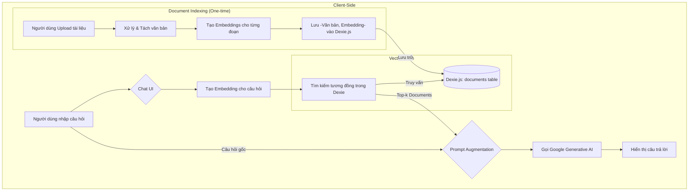

# Kế hoạch tích hợp RAG (Retrieval-Augmented Generation)

Dự án này sẽ tích hợp RAG vào ứng dụng HR Assistant, cho phép hệ thống trả lời các câu hỏi dựa trên một bộ kiến thức được cung cấp (ví dụ: CV, chính sách công ty, mô tả công việc). Giải pháp này sẽ được triển khai hoàn toàn trên client-side bằng cách sử dụng Dexie.js làm vector store.

## Sơ đồ kiến trúc

## Kế hoạch chi tiết

- [ ] **1. Cài đặt thư viện & Cấu hình**
    - [ ] Cài đặt `transformers.js` hoặc một thư viện embedding phù hợp nếu `@google/genai` không hỗ trợ tạo embedding phía client hiệu quả.
    - [ ] Cấu hình môi trường để xử lý các mô hình AI/ML trên trình duyệt.

- [ ] **2. Cập nhật Database (Dexie.js)**
    - [ ] Chỉnh sửa file [`src/lib/db.ts`](src/lib/db.ts:1).
    - [ ] Thêm một bảng (object store) mới tên là `documents` với cấu trúc: `{ id, content, embedding, metadata }`.

- [ ] **3. Xây dựng Document Processing Service**
    - [ ] Tạo file `src/lib/rag/documentProcessor.ts`.
    - [ ] Implement chức năng đọc và tách văn bản từ file (text, PDF).
    - [ ] Implement chức năng gọi API của Google AI để tạo vector embedding cho từng đoạn văn bản.
    - [ ] Implement chức năng lưu văn bản gốc và embedding vào bảng `documents` của Dexie.

- [ ] **4. Xây dựng Retrieval Service**
    - [ ] Tạo file `src/lib/rag/retrievalService.ts`.
    - [ ] Implement chức năng tạo embedding cho câu hỏi đầu vào.
    - [ ] Implement hàm tính toán `cosine similarity` giữa embedding của câu hỏi và các embedding trong Dexie.
    - [ ] Implement chức năng truy vấn, sắp xếp và trả về `k` tài liệu liên quan nhất.

- [ ] **5. Tích hợp vào Giao diện Chat/Interview**
    - [ ] Xác định component UI cần sửa (ví dụ: [`src/features/interview/InterviewRoom.tsx`](src/features/interview/InterviewRoom.tsx:1)).
    - [ ] Trước khi gửi prompt đến LLM, gọi `RetrievalService` để lấy context.
    - [ ] Bổ sung context vào system prompt hoặc user prompt.
    - [ ] Gửi prompt đã được bổ sung đến Google Generative AI.
    - [ ] (Tùy chọn) Hiển thị các nguồn đã được sử dụng để tạo câu trả lời.

- [ ] **6. Tạo Giao diện Quản lý Tài liệu (CRUD)**
    - [ ] Tạo một trang/component mới trong `src/features/documents/`.
    - [ ] Xây dựng UI cho phép người dùng upload file (kéo/thả).
    - [ ] Hiển thị danh sách các tài liệu đã được nạp vào hệ thống.
    - [ ] Cho phép người dùng xóa tài liệu khỏi vector store.
    - [ ] Hiển thị trạng thái xử lý (indexing).
